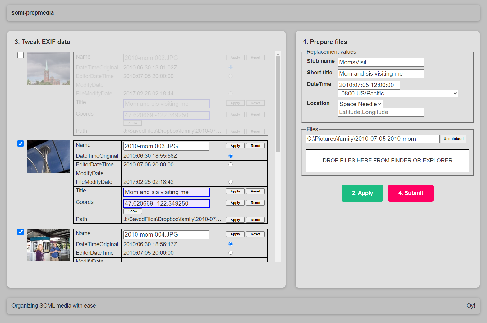

# soml-prepmedia

A web interface to make it a bit easier to set metadata about media (movie, pic) files.
It uses [Exiftool](https://exiftool.org) on the back end.
(Actually, exiftool works on all kinds of files, but media is what I'm interested in.)



## Purpose

To be used for cataloging Story of My Life (SoML) media.

SoML will basically be a blog of events, where the date of the media available
is pulled into the blog article with the same date.
Because I haven't yet found a good API for exactly how that will work,
I'm capturing as much important information as possible in this web interface:

- Files named as local `{{date}}_{{time}}` followed by a brief description
- EXIF GMT "datetime original",
  by selecting from various options that the file might already have stored based on your camera
- EXIF title, for extended descriptive information
- EXIF location information;
  to use the little map displayed with the **show** button (not required),
  you'll need a paid Google account

### Example file naming convention

I'm using this to catalog images before this century,
which means I won't always know the exact date and time.
There are standards emerging on how to represent estimated dates,
but we're not there yet.
Since I'd like the ordering to remain somewhat consistent,
I'm hoping the following standard will work for my stuff.
Have a folder for each year and a decades folder for unsure stuff (e.g. ..., `1978`, `1979`, `1970s`)

| Filename format | EXIF time | Description |
|---|---|---|
| `YYYYmmDD_HHMMSS_desc` | HHMMSS+zone | exact date and time known |
| `YYYYmmDD_000000_desc` | 200000 GMT | exact date known (not time) - midnight PST will be 8 p.m. GMT |
| `YYYYmm00_mmm_desc` | 200000 GMT | exact month known e.g. `19860900_Sep_21st-birthday-party` |
| `YYYY{02,05,08,11}00_NQ_desc` | 200000 GMT | exact season known e.g. `19860500_2Q_first-communion` |
| `YYYY{03,09}00_{1H,2H}_desc` | 200000 GMT | first or second half of year known e.g. `19860900_2H_sophomore-first-semester` |
| `YYYY0000_YR_desc` | 200000 GMT | exact year known only e.g. `19860000_YR_sophomore-college` |
| `YYY0s_desc` | 200000 GMT | rough decade known (put in separate decade folder e.g. 1970s) |


## Using this thing

I started to use a CLI, but didn't feel I had enough control, particularly in
choosing which date to use while handling a batch of files. I thus created a
web app instead.

### Web application

**Installation:**

Install
[Perl]() and
[ImageMagick]().

With CPAN, install some Perl modules, including Mojolicious and some plugins:

```
cpan
install Image::Exiftool
install MIME::Base64
install Mojolicious
install Mojolicious::Plugin::JSONConfig
install Mojolicious::Plugin::StaticCache
quit
```

**Procedure:**

1. Run `server.pl` and open `http://localhost:8989` in a browser.
   Size the browser so there's plenty of room in the EXIF data area.
   Next to the app, open a file explorer window with the files you want to work on.

   **Note:** The app sets filenames based on EXIF data,
   but it doesn't parse filenames to see if they contain datetime data to choose from.
   If you are working on files that have already captured the timestamps in the filename
   (and you'll want to use those timestamps),
   I'm running the Windows `exiftool.exe` on the files beforehand to capture that date and time in the EXIF data
   so that the web app can make use of it. Both images and videos have DateTimeOriginal,
   so let's use that.
   
   ```
   exiftool "-datetimeoriginal<filename" -overwrite_original *.mp4
   ```
   
   (If you're on Mac or Linux and need another way to do this, lemme know.)

1. Choose a batch of files belonging to a common event and apply a set of common values
   to the files.

   1. Enter data about those files in the Replacement values section.
   1. Specify the path to those files. (Browser app can't determine the local path.)
   1. Select and drag those files from your explorer onto the file drop pad in the app.
      The perl server provides existing file info that's "relevant (to me)".
   1. Click **Apply values** to write the replacement values to each file.
      (Original values are kept in the title attributes of each field.)

1. In the EXIF data area, select the date you want to use, change, revert, reapply,
   or otherwise tweak all the data fields to how you want them.
   Get everything displayed how you want it because what is shown is what will be sent to the server.

1. Click **Submit**, which writes the JSON request to be sent to the server and displays it.

1. Review the details and click **Confirm and write to files** or cancel
   (and keep tweaking or whatever).

## Old CLI (Don't use)

It's here, but I'd recommend NOT using `cli-prepmedia.pl`.
I haven't updated it in a while and don't know exactly what EXIF fields it sets.

**Dependencies:**

- Perl modules: Image::ExifTool, File::DosGlob (if Windows), File::Glob

**Procedure:**

```
cli-prepmedia.pl [ -o ]( -d <dirname> | -f <filename-or-wildcard> )
```

For a file, flat directory of files, or fileset, enter the data you want to set.

- GPS latitude, longitude (entered as comma separated string, per google maps)
- Date and time the content pertains to (when the event happened)
- Comment about the image (subject matter, people involved, tags)

If these are already set (such as with modern cameras),
it skips them except for the comment, where it will ask if you want to override it.

Finally, if the file isn't already named according to the DateTimeOriginal naming convention,
it renames the file based on its own datetime, or if not present in the EXIF,
the one you specify, with indexes tacked on the end if necessary for uniqueness.

**Example:**

```
C:\MyPics>perl prepmedia.pl -f samples\IMAG01*

Will work on the following files:
samples\IMAG0101.jpg
samples\IMAG0102.jpg
Proceed? (y|n) (or 'q' to quit)
=> y
The DateTime the media was taken as YYYYMMDD_HHMMSS(+|-)ZZZZ (or 'q' to quit)
=> 20190303_170000-0700
Descriptive new stubname (or blank to keep the existing basename) (or 'q' to quit)
=> DinnerParty
Gimme the Lat, Long coordinates (or 'q' to quit)
=> 47.63238063169254, -122.34962249554108
Wanna add a comment? (y|n) (or 'q' to quit)
=> y
Comment (or 'q' to quit)
=> Uncle Joe, Sarah, Dawn, and Dave
Writing samples\IMAG0101.jpg to samples\picz\20190303_185212_DinnerParty.jpg..
Writing samples\IMAG0102.jpg to samples\picz\20190303_185248_DinnerParty.jpg..
```

## Notes

- Tested on Windows 10, but should work on Mac and Linux.
- See TODO file and TODO comments in source
